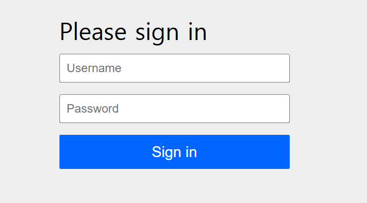

JPA 에 대해서 딥하게 공부하면서 테스트 해보려고 하는데, 공부하려면 다른 부분도 어느정도 공부하고 적용해두고
애플리케이션을 실행시켜야 이것저것 해볼 수 있다는게 매우 불편한 사실이다. 

간단하게 스프링 시큐리티를 적용해두고 테스트 해보려고 한다.


### 1. 의존성 추가하기
```
implementation 'org.springframework.boot:spring-boot-starter-security'
```


다음과 같이 의존성을 추가하면 모든 경로에 인증을 해야한다. 비밀번호는 부트 실행 시 콘솔에
제공된다. 

제공된 비밀번호와 아이디를 통해서 로그인 해보자.
- id : user
- pw : ${generated Value}

로그인에 성공하면, jsession 이 지급되면서 쿠키에 저장이 된다.

### 2. 간단한 테스트를 하기위한 화면을 위해서 타임리프 의존성 추가
```
implementation 'org.springframework.boot:spring-boot-starter-thymeleaf'
```

그리고 home페이지를 나타내는 간단한 html을 작성해보자.
`src/main/resources/tempates/home.html`
